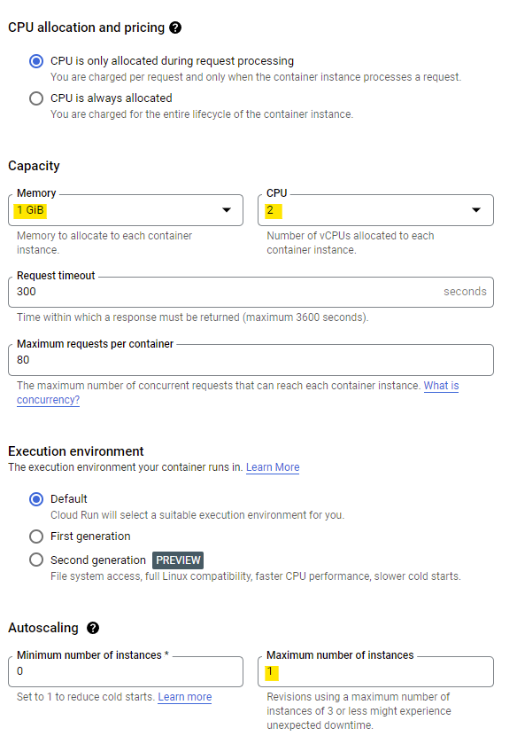

# Camunda 7 for Google Cloud
This is a small repository with a customized Camunda 7 being deployed in cloud. While the documentation covers deployment at Google Cloud Run, the docker image is universal and can be deployed anywhere.

Included:
- Camunda Run 7.17
- [Community history plugin](https://github.com/datakurre/camunda-cockpit-plugins) by [datakurre](http://datakurre.pandala.org/)
- Option to set admin password and admin username

# Usage
Check `configuration/default.yml` for configuration, esspecially setting up admin password. By default admin user/password is `demo/demo` but you may override the properties by providing environment variables:
- `ADMIN_USERNAME`
- `ADMIN_PASSWORD`

*Security Advise*: Provide the password and username as secret. GCP has a secret store, which will make secrets available as environment variable in Cloud Run.

# Google Cloud
This section covers deploying Camunda7 in Cloud Run.

## Prerequisites
- Google Cloud account and have access to a Google Cloud Project: https://console.cloud.google.com/
- gcloud CLI installed in your local workspace: https://cloud.google.com/sdk/docs/install

I use VS Code. There is Google extension available, but I do prefer command line of wizards.

## Deploy Camunda 7 in Google Cloud Run
In order to deploy this Camunda 7 you need the following command:
`gcloud run deploy --source .`

In case gcloud is not connected to your local workspace, yet, it will prompt you the commands to do so.

## Configure Camunda 7 environment
When configuring the cloud run environment the following setting are sufficient for demo purposes:
- 1 GB of memory
- 2 CPU

As long as you run on the internal H2 database, make sure your maximum number of instances is equal to 1. Otherwise Cloud Run will start several independent instances with each their own individual database. Like that, you process model would randomly end up in one instance, while your external task worker tries to acquire a topic from another instance unaware of the process.

For cost efficiency, I would allow a minimum of 0, so the instance is automatically shutdown in idle time. As long as you do not have jobs (cleanup jobs, timer events etc.), this setting should save you some budget without messing with the automation experience.

